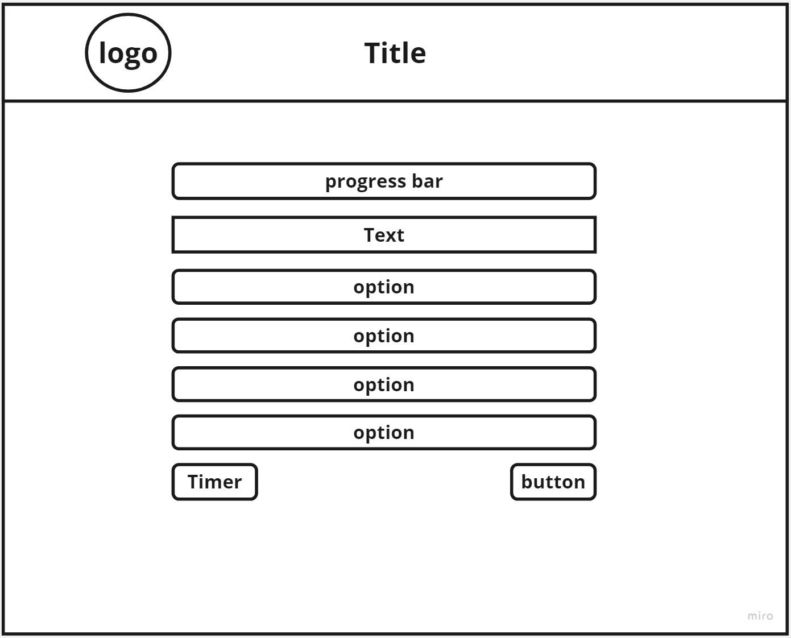

# 🎯 React Quiz App

A single-page web application that tests the user's **React mastery** with 15 timed questions.

[🚀 View Live on Netlify](https://testinreact.netlify.app/)

## 🖼️ Wireframe



## 🛠 Tech Stack

- **Frontend**: React.js, HTML, CSS, JavaScript
- **Backend**: Node.js, Express.js
- **Tools**: Git, GitHub, VSCode, Miro
- **Deployment**: Netlify (frontend), Render (backend)

## 🧩 Features

- Interactive multiple-choice quiz with instant scoring
- 30-second timer per question
- Dynamic progress and scoring system
- Responsive design
- Restart and finish functionality
- Clean and modular code using React hooks like useEffect and useReducer

## 🧪 Run Locally

```bash
# Clone the project
git clone git@github.com:your-username/ReactQuiz.git
cd dirName

# Install dependencies
npm install

# Start the frontend
npm run dev

```

# React + Vite

This template provides a minimal setup to get React working in Vite with HMR and some ESLint rules.

Currently, two official plugins are available:

- [@vitejs/plugin-react](https://github.com/vitejs/vite-plugin-react/blob/main/packages/plugin-react) uses [Babel](https://babeljs.io/) for Fast Refresh
- [@vitejs/plugin-react-swc](https://github.com/vitejs/vite-plugin-react/blob/main/packages/plugin-react-swc) uses [SWC](https://swc.rs/) for Fast Refresh

## Expanding the ESLint configuration

If you are developing a production application, we recommend using TypeScript with type-aware lint rules enabled. Check out the [TS template](https://github.com/vitejs/vite/tree/main/packages/create-vite/template-react-ts) for information on how to integrate TypeScript and [`typescript-eslint`](https://typescript-eslint.io) in your project.

---

_By Murad Dabbous_
